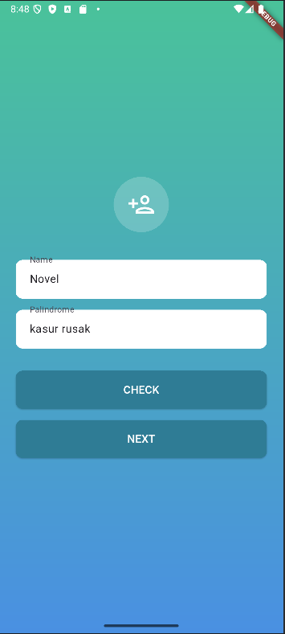
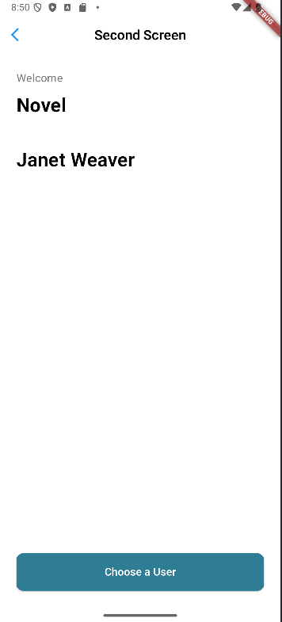

# 📱 Palindrome Checker App

A simple Flutter application that checks if a sentence is a palindrome, displays user-selected data from an API, and manages navigation between three screens.


## 📖 Table of Contents
- [📖 Table of Contents](#-table-of-contents)
- [🚀 Features](#-features)
- [🛠️ Tech Stack](#️-tech-stack)
- [📸 Screenshots](#-screenshots)
- [📂 Project Structure](#-project-structure)
- [⚙️ Installation & Setup](#️-installation--setup)
- [▶️ Running the App](#️-running-the-app)

---

## 🚀 Features
✅ **Palindrome Checker** – Checks if a sentence is a palindrome and displays the result in a dialog.  
✅ **User Selection from API** – Fetches a list of users from the [ReqRes API](https://reqres.in/) with pagination.  
✅ **Navigation Between Screens** – Three screens with smooth transitions.  
✅ **State Management with Provider** – Efficient state management for performance and maintainability.  
✅ **Pull-to-Refresh & Infinite Scroll** – Load more users dynamically when scrolling down.  

---

## 🛠️ Tech Stack
- **Flutter** 3.22+
- **Dart**
- **State Management**: Provider
- **Networking**: HTTP package
- **Navigation**: `Navigator.push` & `Navigator.pop`

---

## 📸 Screenshots
| First Screen | Second Screen | Third Screen |
|-------------|--------------|-------------|
|  |  |  |

---

## 📂 Project Structure
The project follows the **MVVM (Model-View-ViewModel) architecture**.

```sh
palindrome_checker_app/
 ├── lib/
 │   ├── models/         # Data models (User, Palindrome)
 │   ├── views/          # UI screens (FirstScreen, SecondScreen, ThirdScreen)
 │   ├── viewmodels/     # State management (Provider)
 │   ├── services/       # API calls
 │   ├── styles/         # Global styling
 │   ├── main.dart       # Entry point
 ├── assets/             # Images
 ├── pubspec.yaml        # Project dependencies
 ├── README.md           # Project documentation
```

---

## ⚙️ Installation & Setup
1. **Clone the repository**:
    ```sh
    git clone https://github.com/novelxv/palindrome-checker-app.git
    ```
2. **Navigate to project directory**:
    ```sh
    cd palindrome-checker-app
    ```
3. **Install dependencies**:
    ```sh
    flutter pub get
    ```
4. **Run the app**:
    ```sh
    flutter run
    ```

---

## ▶️ Running the App
To run the app, follow these steps:
1. Open the project in your preferred IDE (e.g., Android Studio, Visual Studio Code).
2. Connect your device/emulator and run the app using the `Run` button.
3. The app will start on your device/emulator.